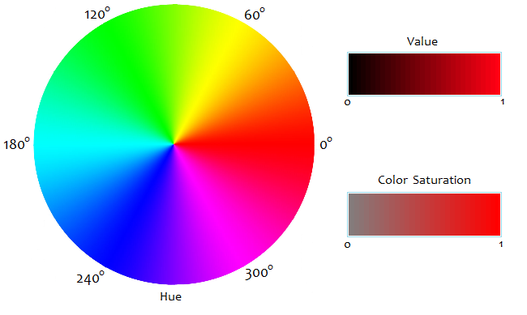

# HSV
Hue (оттенок) – число в пределах [0º, 360º), указывающее на определённый угол (в градусах) на цветовом колесе (Color wheel) (Например, 0° = красный, 60° = желтый, 120° = зеленый,
180 ° = голубой, 240° = синий, 300° = пурпурный)

Saturation (насыщенность) – число от 0 до 1, означающее близость цвета к нейтральным цветам. Яркие, чистые цвета имеют более высокое значение насыщенности.
Приглушённые, серые цвета имеют низкое значение насыщенности. Цвета близкие к черному или белому имеют значение насыщенности, близкое к 0.

Value (значение) – число от 0 до 1, указывающее на максимальное число среди компонент RGB представления, поделённое на 255. Как белые, так и чистые цвета имеют значение V = 1.

### From RGB
M = max{R, G, B}

m = min{R, G, B}

##### Value:

V = M / 255

##### Saturation:

if M > 0 => S = 1 - m / M

if M = 0 => S = 0

##### Hue:

if G >= B => H = acos[ (R - ½G - ½B)/√R² + G² + B² - RG - RB - GB ]

if G < B => H = 360º - acos[ (R - ½G - ½B)/√R² + G² + B² - RG - RB - GB ]

acos – в градусах

Для оттеноков серого для удобства используется Hue = 0º

### To RGB

M = 255V

m = M (1 - S)

z = (M-m)[1 - |(H/60)mod_2 - 1|]

##### <ins>0 ≤ H < 60:</ins>

R = M

G = z + m

B = m

##### <ins>60 ≤ H < 120</ins>

R = z + m

G = M

B = m

##### <ins>120 ≤ H < 180</ins>

R = m

G = M

B = z + m

##### <ins>180 ≤ H < 240</ins>

R = m

G = z + m

B = M

##### <ins>240 ≤ H < 300</ins>

R = z + m

G = m

B = M

##### <ins>300 ≤ H < 360</ins>

R = M

G = m

B = z + m

Source: [had2know]([had2know](https://www.had2know.org/technology/hsl-rgb-color-converter.html))