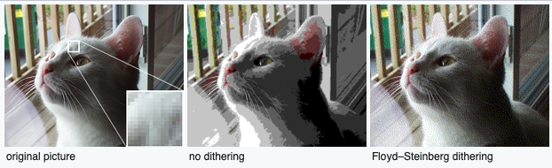

# Алгоритм Флойда-Штейнберга
Алгоритм Флойда-Штейнберга - это алгоритм дизеринга изображений, впервые опубликованный в 1976 году Робертом У. Флойдом и Луисом Стейнбергом.
Он обычно используется программами для обработки изображений, например, когда изображение преобразуется в формат GIF, 
который ограничен максимум 256 цветами.

Алгоритм дизеринга организован с помощью принципа распространения ошибки. При обработки пикселя ошибка по итогу его обработки передаётся соседним
пикселям по определённой схеме.

Данная матрица задаёт схема распространения ошибки:

| ... | ...    | current | 7 / 16 | ... |
|-----|--------|---------|--------|-----|
| ... | 3 / 16 | 5 / 16  | 1 / 16 | ... |

Current – пиксель, обрабатываемый в данный момент

Алгоритм:
1) Выбираем пиксель для обработки и получаем его цвет в некотором цветовом пространстве
2) Сравниваем значения оригинального цвета и нового цвета в соответствии с указанной битностью или битностью графического устройства
3) Получаем значение ошибки, путём вычитания значения нового цвета из значения оригинального цвета
4) Распространяем ошибку на соседние пиксели в соответствии с вышеуказанной схемой, умножая значение ошибки на коэффициенты и прибавляя
результат к значениям соседних пикселей

Source: [wiki](https://en.wikipedia.org/wiki/Floyd–Steinberg_dithering)