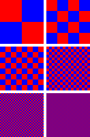

# Дизеринг
Проблемы возникают каждый раз, когда изображение отображается на устройстве, которое поддерживает меньше цветов, чем содержит изображение. 
Тонкие градиенты в исходном изображении могут быть заменены пятнами однородного цвета, и в зависимости от ограничений устройства, исходное 
изображение может стать неузнаваемым.

Псевдотонирование (или дизеринг) — это попытка решить эту проблему. Псевдотонирование работает через приближённое выражение недоступных 
цветов доступными, для чего доступные цвета смешиваются так, чтобы имитировать недоступные.

В компьютерной графике дизеринг используется для создания иллюзии глубины цвета для изображений с относительно небольшим количеством 
цветов в палитре. Отсутствующие цвета составляются из имеющихся путём их «перемешивания». Например, если необходимо получить отсутствующий 
в палитре фиолетовый цвет, его можно получить, разместив красные и синие пиксели в шахматном порядке; оранжевый цвет может быть составлен 
из красных и желтых точек.

Source: [wiki](https://ru.wikipedia.org/wiki/Дизеринг)