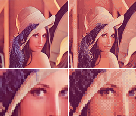

# Упорядоченный алгоритм
Упорядоченный алгоритм – это алгоритм дизеринга изображений. Он обычно используется для отображения непрерывного изображения на дисплее 
с меньшей глубиной цвета. Например, Microsoft Windows использует его в 16-цветных графических режимах. Алгоритм характеризуется заметными 
шаблонами перекрестной штриховки.

Алгоритм уменьшает количество значимых цветов, применяя пороговую схему M к отображаемым пикселям, в результате чего некоторые пиксели меняют цвет 
в зависимости от разницы между исходным цветом и доступными цветами в уменьшенной палитре.

### Схемы
Пороговые схемы бывают разные, но обычно это квадратные матрицы с размерностью, соответствующей какой-либо степени 2.

Примеры:

| 0     | 1 / 4 |
|-------|-------|
| 3 / 4 | 1     |

| 0       | 8 / 16  | 2 / 16  | 10 / 16 |
|---------|---------|---------|---------|
| 12 / 16 | 4 / 16  | 14 / 16 | 6 / 16  |
| 3 / 16  | 11 / 16 | 1 / 16  | 9 / 16  |
| 15 / 16 | 7 / 16  | 13 / 16 | 5 / 16  |

Схемы могут быть "отсиметричнены" или повёрнуты без потери эффективности их работы.

### Преобразование
Алгоритм упорядоченного дизеринга отображает изображение как обычно, но для каждого пикселя он смещает его цветовое значение соответствующим 
значением пороговой схемы в соответствии с его местоположением, в результате чего значение пикселя квантуется в другой цвет, если оно превышает порог.

Формула преобразование пикселя:

`Color new = nearest_palette_color(Color old + r * Map(x mod n, y mod n) - 1 / 2)`

`Color new / Color old` – новое/старое значение цвета

`Map` – пороговая схема (матрица)

`n` - размерность пороговой схемы

`r` – вычисляет путём деление максимального значения цветовой компоненты (обычно 255 или 1.0) на N, где N определяется RGB палитрой, содержащей 
2 ^ (3 * N) равномерно распределённых цветов

`nearest_palette_color` – функция, возвращающая новый цвет с учётом новой битности

1 / 2 вычитается из полученного числа для нормализации ошибки, то есть сведения суммы ошибки приблизительно к 0

### Примеры работы:
Схема 8x8:

Схема 4x4:

Source: [wiki](https://en.wikipedia.org/wiki/Ordered_dithering)