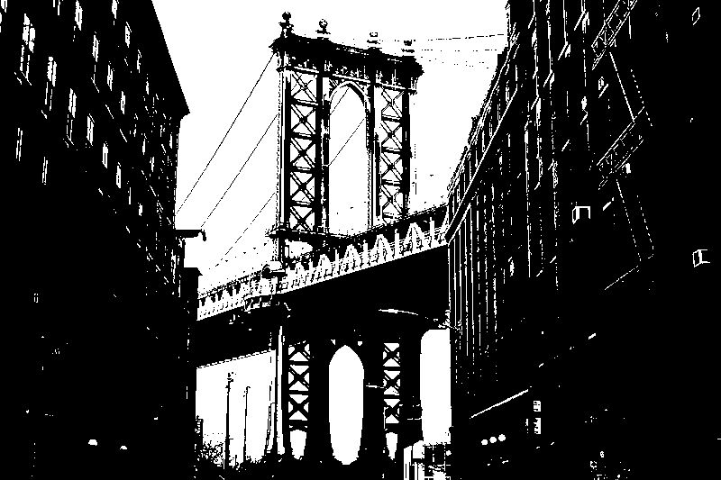
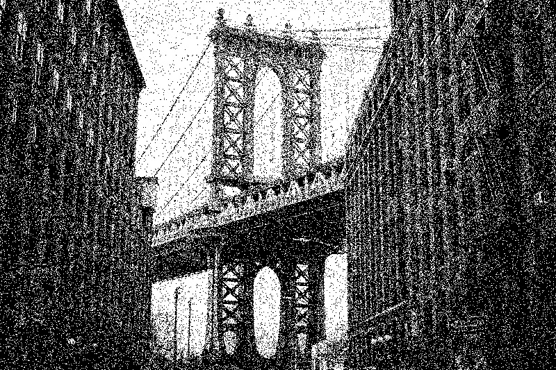

# Рандомный алгоритм
Один из самых простых алгоритмов дизенринга.

Этот алгоритм является видоизменённым порогового алгоритма.

### Пороговый алгоритм:
1) Задаём порог
2) Берём пиксель
3) Сравниваем значение пикселя (в случае с цветным изображением одну из цветовых компонент) с порогом
4) Если значение оказывается меньше, то окрашиваем пиксель в чёрный цвет. Иначе – пиксель в белый цвет

### Рандомный алгоритм
Рандомный алгоритм работает по той же схеме, которая описана выше, за исключение того, что порог вычисляется для каждого пикселя отдельно
путём генерации случайного числа от 0 до 255 (или друого значения в зависимости от максимального оттенка модели)

Сравнение оригинального изображения, результата работы порогового алгоритма с порогом 127 и результата работы рандомного алгоритма:

Source: [nerd hut](https://nerdhut.de/2021/09/08/simple-dithering-algorithms/)