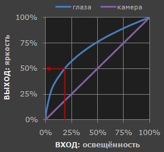

# Гамма коррекция
Гамма-коррекция или коррекция гаммы (иногда — гамма) — предыскажения яркости чёрно-белого или цветоделённых составляющих цветного 
изображения при его записи в телевидении и цифровой фотографии.

Гамма-коэффициент или просто гамма определяет отношение между численным значением пикселя и его действительной светимостью. 
Без коррекции гаммы тёмные тона, снятые цифровыми камерами, не выглядели бы так, как их видят наши глаза. Однако гамма присуща 
не только камерам — собственную гамму имеют файлы изображений, экраны и практически любое другое устройство отображения. 
Говоря о коррекции гаммы, кодировании гаммы или компресии (сжатии) гаммы, подразумевают одно и то же понятие.

### Зачем
В цифровой камере удвоенное количество фотонов, попадающих на сенсор, означает удвоение сигнала (зависимость «линейна»). 
Однако наши глаза устроены иначе. Для нас увеличение освещённости вдвое означает, что свет стал слегка ярче (зависимость «нелинейна»).

По сравнению с камерами мы более чувствительны к малейшим изменениям тёмных оттенков и менее чувствительны к достаточно большим изменениям 
в ярких тонах. Для такой странности есть свои биологические причины: это позволяет нашему зрению работать в более широком диапазоне освещённости. 
В противном случае типичный диапазон яркостей, с которым мы сталкиваемся на улице, был бы невыносим.

Но какое отношение это всё имеет к гамме? В данном случае гаммой мы называем преобразование к светочувствительности наших глаз показаний камеры. 
Когда сохраняется цифровое изображение, оно подвергается «гамма-кодированию» — так чтобы удвоение значения в файле ближе соответствовало тому, 
что мы воспринимаем как удвоение яркости.

Формула: Vout = A * Vin ^ gamma

Vout — это итоговая яркость 

Vin — это исходная/действительная яркость

В общем случае, если A = 1, то входные и выходные значения находятся в пределах от 0 до 1.

### Гамма и оттенки
Поскольку гамма-кодирование перераспределяет тональные уровни ближе к тому, как их воспринимают наши глаза, для описания выбранного 
диапазона тонов требуется меньше бит. В противном случае на яркие тона (где камера имеет большую чувствительность) выделялось бы 
чрезмерно много бит, а на тёмных тонах (где камера менее чувствительна) сказывалась бы их нехватка.

### Обработка гаммы: кодирование и коррекция
Гамма-кодированное изображение требует применения «коррекции гаммы» на этапе просмотра — которая в действительности приводит изображение 
в соответствие с исходной освещённостью. Другими словами, целью гамма-кодирования является запись изображения — но не его отображение. 
Второй этап («гамма дисплея») осуществляется вашими монитором и видеокартой автоматически.

##### Гамма файла
Это преобразование применяется камерой или программой обработки RAW при преобразовании в стандартный файл JPEG или TIFF. 
Оно перераспределяет присущие камере тональные уровни в перцептивно униформные, тем самым обеспечивая наиболее эффективное использование 
доступной глубины цветности.

##### Гамма дисплея 
Это преобразование отражает суммарное влияние видеокарты и дисплея, то есть в действительности может состоять из нескольких гамм. 
Основным назначением гаммы дисплея является компенсация гаммы файла — тем самым гарантируя, что изображение на экране не станет 
ненатурально ярким. Увеличение гаммы дисплея означает более тёмное изображение с повышенным контрастом.

##### Гамма системы
Это преобразование отражает суммарное влияние всех гамма-преобразований изображения, его также называют «гаммой просмотра». 
Для точного отображения гамма просмотра в идеале должна быть близка к прямой линии (гамма = 1.0). Прямая линия гарантирует, 
что изображение на входе (исходная сцена) и на выходе (на экране или в отпечатке) одинаково. Однако гамма системы зачастую 
установлена несколько выше 1.0 с целью повышения контрастности. Это может помочь скомпенсировать ограничения, вызванные динамическим 
диапазоном устройства отображения, а также неидеальными условиями просмотра и бликами в изображении.

### Гамма изображения
Истинная гамма изображения, сохранённого в файле, определяется 
1) гаммой камеры (зачастую просто линейной) 
2) гамма-кодированием изображения с сопутствующим профилем цветности.

Точная кривая гаммы обычно записана в профиле цветности, который вложен в файл. Большинство пространств цветности для обработки изображений 
используют гамма-кодирование с коэффициентом 1/2.2 (такие как sRGB и Adobe RGB 1998). Хотя файлы RAW имеют линейную гамму, программы 
просмотра файлов RAW показывают их, предполагая стандартное гамма-кодирование 1/2.2, поскольку иначе они могут выглядеть слишком тёмными.

### Гамма дисплея
Гамма дисплея — единственная составляющая, которая обычно поддаётся коррекции (с использованием калибраторов монитора и регуляторов 
яркости/контраста). К счастью, индустрия сошлась на стандартной гамме дисплея 2.2, так что нет повода беспокоиться по поводу достоинств 
и недостатков различных значений.

Итоговая гамма дисплей в действительности состоит из собственной гаммы монитора и коррекции гаммы, внесенной самим монитором или видеокартой. 
Однако влияние каждой из них чрезвычайно зависит от типа монитора.

### sRGB
sRGB (standart RGB) является стандартом представления цветового спектра с использованием модели RGB. sRGB создан совместно компаниями HP 
и Microsoft в 1996 году для унификации использования модели RGB в мониторах, принтерах и Интернет-сайтах.

В отличие от большинства других цветовых пространств RGB, гамма в sRGB не может быть выражена одним числовым значением, так как функция 
коррекции состоит из линейной части около чёрного цвета, где гамма равна 1.0, и нелинейной части до значения 2.4 включительно. 
Приблизительно можно считать, что гамма равна 2.2. Гамма может изменяться от 1.0 до 2.3.

Color linear и Color sRGB от 0 до 1

Color sRGB = 

if Color linear <= 0.0031308 => 12.92 * Color linear

if Color linear > 0.0031308 => (1 + 0.055) * (Color linear) ^ 1 / 2.4 - 0.055

Source: 

[cambridge in colour](https://www.cambridgeincolour.com/ru/tutorials-ru/gamma-correction.htm)

[sRGB](https://ru.wikipedia.org/wiki/SRGB)