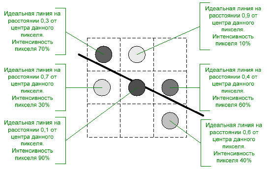
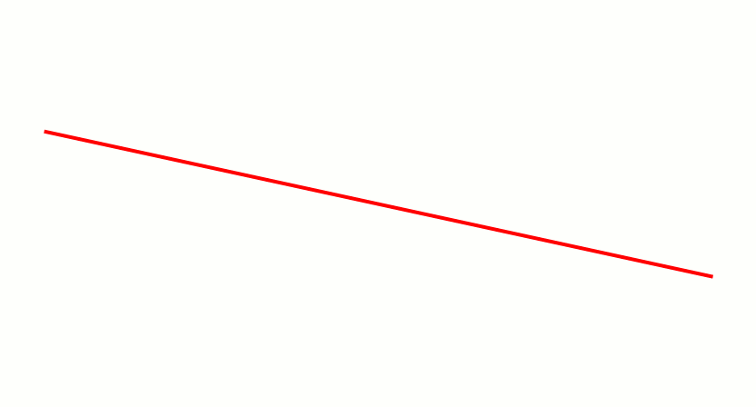

# Алгоритм Ву
Алгоритм Ву — это алгоритм разложения отрезка в растр со сглаживанием. Был предложен У Сяолинем (Xiaolin Wu, отсюда устоявшееся 
в русском языке название алгоритма) в статье, опубликованной журналом Computer Graphics в июле 1991 года. 
Алгоритм сочетает высококачественное устранение ступенчатости и скорость, близкую к скорости алгоритма Брезенхема без сглаживания.

Горизонтальные и вертикальные линии не требуют никакого сглаживания, поэтому их рисование выполняется отдельно. Для остальных линий 
алгоритм Ву проходит их вдоль основной оси, подбирая координаты по неосновной оси аналогично алгоритму Брезенхема. Отличие состоит в том, 
что в алгоритме Ву на каждом шаге устанавливается не одна, а две точки. Например, если основной осью является Х, то рассматриваются точки 
с координатами (х, у) и (х, у+1). В зависимости от величины ошибки, которая показывает, как далеко ушли пиксели от идеальной линии по неосновной 
оси, распределяется интенсивность между этими двумя точками. Чем больше удалена точка от идеальной линии, тем меньше её интенсивность. 
Значения интенсивности двух пикселей всегда дают в сумме единицу, то есть это интенсивность одного пикселя, в точности попавшего 
на идеальную линию. Такое распределение придаст линии одинаковую интенсивность на всём её протяжении, создавая при этом иллюзию, 
что точки расположены вдоль линии не по две, а по одной.

Source: [wiki](https://ru.wikipedia.org/wiki/Алгоритм_Ву)